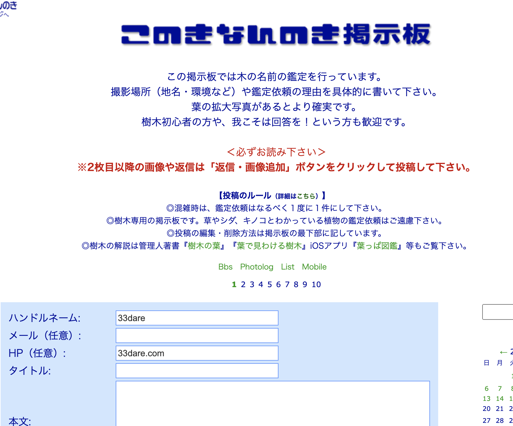
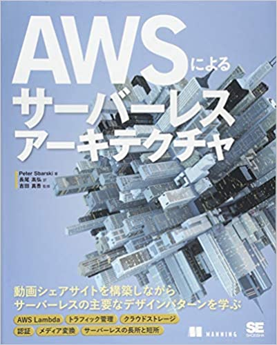

---
### 自己紹介
**名前**：ゆうき
**仕事**：現在Webの受託開発企業で主にvue書いてます


---
### 何を作ったのか
サーバレスで画像アップロード掲示板

---
### なぜ？
- 正直掲示板を使ったことがなく、どういう機能が必要なのかのイメージがつかなかったから |
- 単純な興味本意 |
- 地獄の始まり |

---
### どんなものを作ったのか
URL: https://yuuki-aws-dev.work

---
### 参考サイト: 
このきなんの木掲示板

---?image=LT_IMAGE/nayami.jpeg
### 5週間やってみて

- １−4週間が壊滅的に進まなかった |

---
### 原因

そこには多くの壁があった(進まなかった要因)
- どんなものを作るのかのイメージができない |
- どうやって開発したらいいのかのイメージがつかない |
-  予期せぬ請求... |

---
### 途中で本を買いました


---
### 2000円の請求

---
### そんなこんなで道のりは長かった
---?image=LT_IMAGE/kanikeijibanv2.png
### 設計
---
### 悩んだ部分

---
### dynamodbの設計
- 日付の管理にテクニックがいる new Date().getTime()
```json
{
  "id": 1,
  "date": 111111111,
  "text": "posttext",
  "comments": [
    {
      "postId": 1,
      "comment": "hogehoge"
    },
    {
      "postId": 2,
      "comment": "hogehoge2"
    }
  ]
}
```
- list_append関数で実現可能
---
### しかしcommentの更新ができない
comments配列にあるidはわかるがindexがわからない。。
更新したい箇所 = comments[i].idが一致するobject

---
### 修正!!!
しかもこうすることで作成、更新、削除全てがputメソッドでできるようになった。
```json
{
  "id": 1,
  "text": "posttext",
  "comments": {
    "1": {
      "comment": "hogehoge"
    },
    "2": {
      "comment": "hogehoge2"
    }
  }
}
```

---
### 細かい問題
- ACMのARNがgithubに上げていいのかわからない |
- - git rebase -i |
- cloudfrontのキャッシュを毎回消さないといけない |
- - Invalidationsを消そう |

---
### 気付き

5週間で終わりです！終わったらLTがあります！<br>
これぐらい追い込まないとやる気にがでない。<br>
のでまたいずれやると思います笑

---
### よかったらまたご参加ください。ありがとうございました。