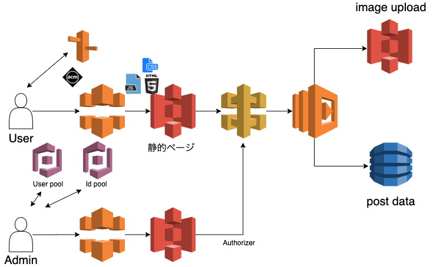

## 画像アップロード掲示板
```
ユーザー用: https://yuuki-aws-dev.work
管理者用: https://admin.yuuki-aws-dev.work
```

### 構成図


## 仕様
- ドメイン
  - ユーザー用: https://yuuki-aws-dev.work
  - 管理者用: https://admin.yuuki-aws-dev.work(基本的に管理者しか見れない)
- ユーザー側
  - 画像のアップロードができる※画像と名前は任意
  - 投稿にはパスワードが必須
  - 記事の投稿時にパスワードをcookieに保存するか選べる
  - cookieの有効期限は1時間
  - 投稿を削除・編集するにはパスワードを入力しないといけない
  - 編集では画像と投稿内容の編集ができる
  - 投稿内容にコメントが送信できる
- 管理者側
  - emailとpasswordでログインができる
  - 管理画面からログアウトができる
  - 未ログイン時は/login.htmlにリダイレクトされる
  - 管理者はどの投稿もパスワードなしで削除ができる

### 各種バージョン
```
yarn: v1.22.4
node: v12.1.0
serverless 2.12.0
```

### 事前に必要なもの
- route53のホストゾーンにドメインを登録する
- acmをドメインと*.ドメインの二つ登録する
- ターミナルで以下を打ち込む(環境変数にacmを登録)
```
例
export ACM_ARN=arn:aws:acm:us-east-1:111111111:certificate/111111111-1111-1111-1111-11111111111
```

### 使い方
```
- 開発用
staticディレクトリの変更をwatchして、/distにバンドルファイルを出力してくれる
$ yarn build-dev

別ターミナルでローカルサーバーを立ち上げる
$ yarn start

- 本番用
/distに本番用のバンドルファイルを出力してくれる
$ yarn build-prod

- serverless frameworkのコマンド

serverless.ymlファイルを全てデプロイ
$ sls deploy -v

lambdaファイルをデプロイ
$ sls deploy function -f ファンクション名

静的ファイルをデプロイ
$ sls syncToS3
```

## 使用技術

### インフラ
- lambda(node v12)
  - api gatewayを通してdynamodbにデータを送信する
  - s3に画像をアップロード(CRUD処理)
- s3
  - webホスティング(ユーザ用と管理者用)
  - 画像をアップロードする
- api gateway(adminはauthorizer)
- dynamodb
- cognito(User PoolとId Pool)
  - 管理者ページの認証と認可を担当
- route53
  - URL: yuuki-aws-dev.work(ユーザー用)
  - URL: admin-aws-dev.work(管理者用)
- cloudfront
  - s3のwebホスティングをSSL化

* DBのスキーマ
```
id: string(uuid)
date: number(UTC時間)
name: string(指定がなかった場合は[名無し])
text: string
comments: object
  {
    id: {
      comment:string
      date: number(UTC時間)
      name: string(指定がなかった場合は[名無し])
    }
  }
password: string(更新と削除をする時に必ず必要)
imageURL: string(S3のURL)
cookieFlag: string(cookieを指定するかどうか)
```

- フロントエンド

HTML/Javascript/css
webpack: 難読化/パフォーマンス向上のため

### 課題
- cookieのパスワードをハッシュ化する
- lambdaとフロントエンドをTypescriptにする
- コメントも削除と更新ができるようにする
- api gatewayのURLを独自ドメインにする
- ページネーションが必要
- serverless.ymlファイルが長くなってきたのでファイル分割する

### 注意点/問題点
- serverless frameworkにて
  - cognitoのカスタムドメインはハードコーディング。UserPoolDomainのGetAttで返り値の設定がされていないため
- javascriptにて
  - webpack4を導入後にテンプレートリテラルの中のonclickがエラーになった。
  - addEventListenerの関数に引数を与えようとしたらthisがぐちゃぐちゃになった。

### 参考にさせていただいたサイト
https://kochama.online/thread
https://photobb.net/bbs.cgi?id=10170